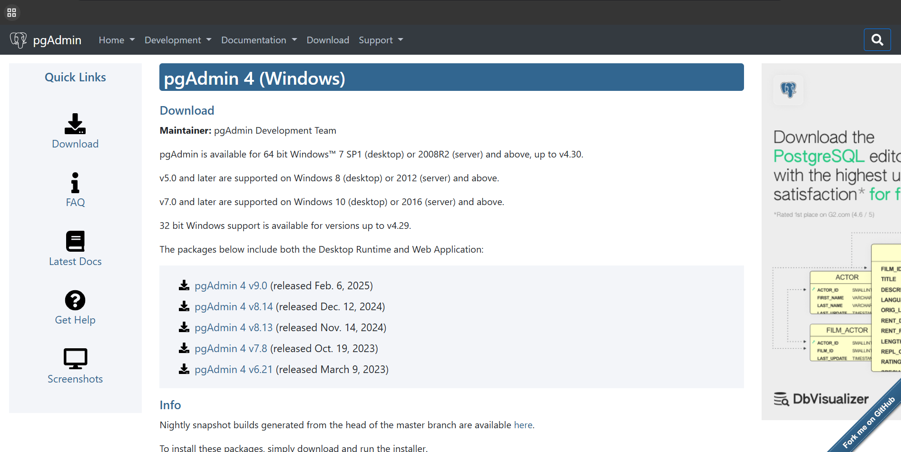

# Database

## Linguagem Utilizada 🧑‍💻
A linguagem utilizada para a criação do banco foi o SQL, que também foi importante para a criação do DataLoad.

## Banco de Dados 🧮

O Banco utlizado foi o PostgreSQL, um Banco Relacional, para podermos utilizar a conexão entre tabelas.

## Instalação 📥

Para se iniciar a instalação para utilizar o banco de dados, se Utiliza o [PgAdmin](https://www.pgadmin.org/download/pgadmin-4-windows/), um Software para criação de DataBases

Após abrir o link, você irá parar nessa tela:

Logo após isso, você precisará clicar na versão mais recente ou a versão que seu professor pedir. E depois fazer a instalação completa com as orientações ditas ao seu professor, ou então segue as orientações	do seguinte [vídeo](https://www.youtube.com/watch?v=_lE-vINotSQ).

## Execusão ▶️

Logo após terminar a instalação, irar abrir o a tela do PgAdmin, e você vai no simbolo de um banco de dados/servidor, clicar com o botão direito, apertar em register e, depois em server.

Você poderá colocar o nome que desejá, e na aba "Connection", você colocará as informações necessárias para a conexão do servidor que você criou no Aiven (empresa que fornece Banco de Dados, como por exemplo, PostgreSQL, MySQL, etc.), por exemplo. 

## Utilização 💻

Dentro do servidor do Aiven, você irá criar um Database, clicando com o botão direito "Create > DataBase", e colocar o nome que desejá pro Banco. 

Para fazer a utilizar o banco que você criou, você irá abrir o servidor, e fazer o seguinte caminha "DataBases > [Nome do Banco] > Schemas > Public > Tables", depois disso, você vai apertar num botão com o simbolo de um banco de dados com um 'play', e depois disso, você pode fazer a utilização do banco, com vários comandos, como Create, Update, Insert, etc. 🤓

Agradeço pela sua atenção. 😁