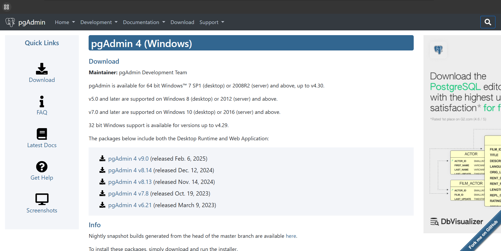

# Database

## Linguagem Utilizada 🧑‍💻
A linguagem utilizada para a criação do banco foi o SQL, que também foi importante para a criação do DataLoad.

## Banco de Dados

O Banco utlizado foi o PostgreSQL, um Banco Relacional, para podermos utilizar a conexão entre duas tabelas.

## Instalação

Para se iniciar a instalação para utilizar o banco de dados, se Utiliza o [PgAdmin](https://www.pgadmin.org/download/pgadmin-4-windows/), um Software para criação de DataBases

Após abrir o link, você irá parar nessa tela:

Logo após isso, você precisará clicar na versão mais recente ou a versão que seu professor pedir. E depois fazer a instalação completa com as orientações ditas ao seu professor, ou então segue as orientações	do seguinte [vídeo](https://www.youtube.com/watch?v=_lE-vINotSQ).

## Execusão

Logo após terminar a instalação, irar abrir o a tela do PgAdmin, e você vai no sim